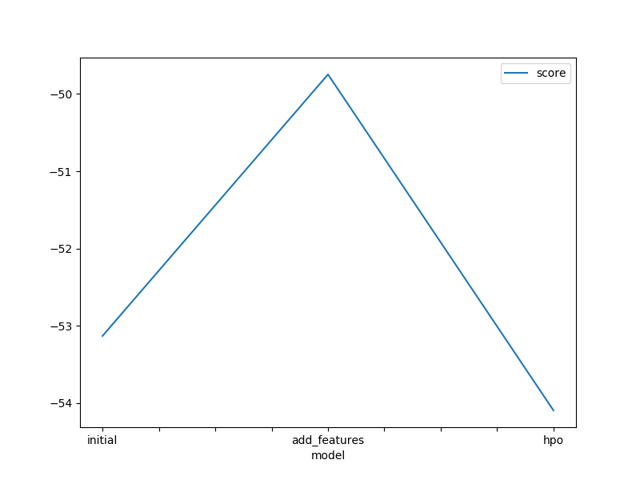

# Report: Predict Bike Sharing Demand with AutoGluon Solution
#### NAME HERE

## Initial Training
### What did you realize when you tried to submit your predictions? What changes were needed to the output of the predictor to submit your results?
Kaggle doesn't allow negative values. Hence I need to transform the negative values into 0 before submitting the results. Among all the predicitions I did including initial training, training after EDA and hyper parameter tuning, only the result of hyper parameter tuning contains negative values and needs me to do the transformation.

### What was the top ranked model that performed?
WeightedEnsemble_L3. It is a weighted ensemble that aggregates the predictions of many other models. Because a single model may not make the perfect prediction for a given data set. With combining multiple models, we have the chance to boost the overral accuracy.

## Exploratory data analysis and feature creation
### What did the exploratory analysis find and how did you add additional features?
- From EDA, I was able to find the distribution of the features and the rough distribution of the target (count) and how it is related with the features.
- I use the pandas.to_datetime() method and datetime.dt.year method to create additional features.

### How much better did your model preform after adding additional features and why do you think that is?
The score is improved from 1.79121 to 0.542157 after adding additional features. IMO, the month, day, hour are 3 features which have impact on the bike sharing demand. The added additional features are able to give these information and be trained and involved in the new model which gives us a better prediction on the test data. 

## Hyper parameter tuning
### How much better did your model preform after trying different hyper parameters?
After trying different hyper parameters, i.e., I changed the num_bag_folds, num_bag_sets and num_stack_levels, the scores are much better than the initial model. And it is similar with the result of adding additional features.

### If you were given more time with this dataset, where do you think you would spend more time?
I will perform more hyperparameter tuning to see if any improves the score.

### Create a table with the models you ran, the hyperparameters modified, and the kaggle score.

| Model       | num_bag_folds | num_bag_sets | num_stack_levels | score   |
| ----------- | ------------- |--------------|----------------- |---------|
| Initial     | 0             | 1            | 0                | 1.79121 |
| Add features| 0             | 1            | 0                | 0.542157|
| Hpo         | 5             | 1            | 1                | 0.55972 |

### Create a line plot showing the top model score for the three (or more) training runs during the project.

### Create a line plot showing the top kaggle score for the three (or more) prediction submissions during the project.

## Summary
In summary, EDA, feature engineering, and hyperparameter tuning are all critical steps in a machine learning project as they can help to improve the accuracy and generalization ability of a model by identifying and addressing issues with the data, selecting relevant features, and optimizing hyperparameters.
